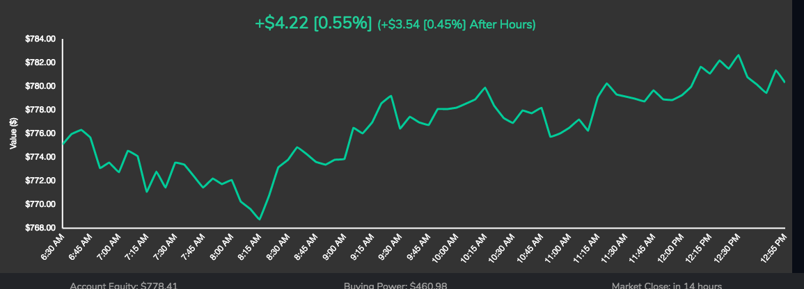
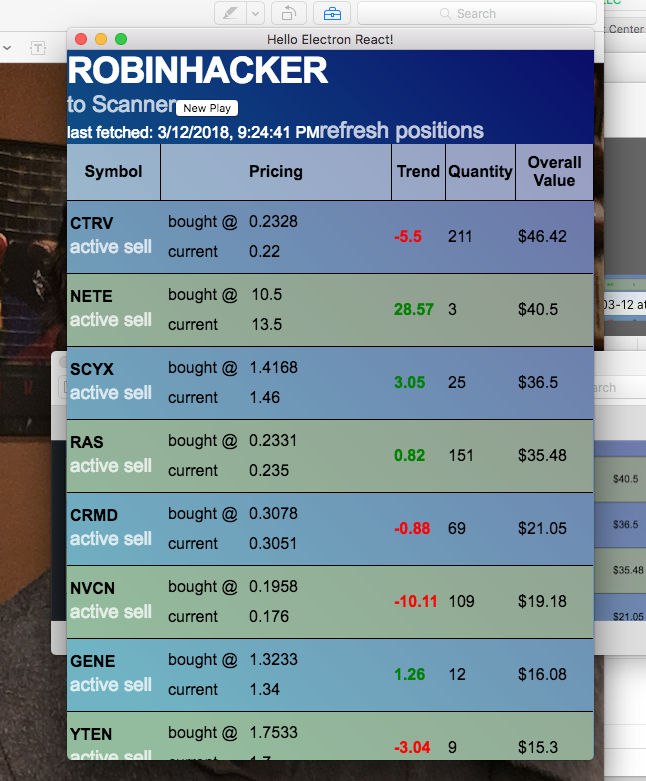
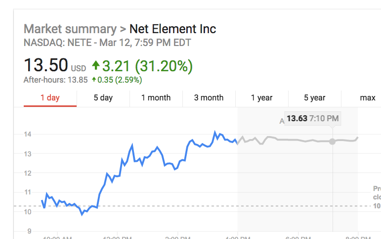
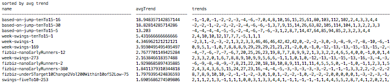
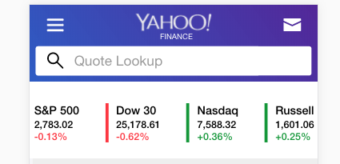
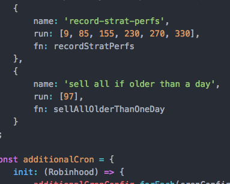

# How did things go today?



```javascript
node analysis/run day-report

report for  2018-3-12.json
Strategies

fizbiz-nanoEarlyRunners
total invested:  86.88536819999999
dollarChange:  -2.7535681999999895
avg trend:  -2.7269999999999994
tickers:  [ 'RAS',
  'SCYX',
  'NVCN',
  'CTRV',
  'SCYX',
  'CRMD',
  'RAS',
  'CTRV',
  'CRMD',
  'NVCN' ]
actual trend:  -3.17

week-swings
total invested:  41.298995399999995
dollarChange:  -0.2589953999999972
avg trend:  -0.5800000000000001
tickers:  [ 'YTEN', 'GENE', 'QUMU', 'YTEN', 'GENE', 'QUMU', 'YTEN', 'GENE' ]
actual trend:  -0.63

based-on-jump-tenTo15
total invested:  31.5039291
dollarChange:  8.9960709
avg trend:  28.56
tickers:  [ 'NETE' ]
actual trend:  28.56

stockinvest-undervalued
total invested:  25.174754999999998
dollarChange:  -0.039754999999997764
avg trend:  0.07166666666666664
tickers:  [ 'BIOS', 'SID', 'MYO', 'SID', 'SFUN', 'BIOS' ]
actual trend:  -0.16

fizbiz-under5TopLosers
total invested:  47.87094109999999
dollarChange:  -1.0081410999999938
avg trend:  -2.1666666666666665
tickers:  [ 'ANTH',
  'OREX',
  'SSKN',
  'SINO',
  'SINO',
  'OREX',
  'ANTH',
  'MBII',
  'SSKN' ]
actual trend:  -2.11

overall
{ totalInvested: 232.73398879999996,
  dollarChange: 4.935611200000022,
  trend: 2.12 }
  ```

## Burrito Wrap Up

Of the purchases made today, up 2.12%- not bad.  

Something that is worth to bear in mind is that this is being calculated after hours.  And these stocks are not necessarily going to be sold right in the morning, so they will undoubtably fluctuate tomorrow before they are sold or held for another day.  Currently it sells 50% of the stares of stocks that were purchased 1 day ago and the remaining shares the following day.  

Encouraging to see is the performance of based-on-jump-tenTo15...  You can see the big pick of the day was NETE which was a based-on-jump-tenTo15 pick:



And up 3% after hours.



```javascript
{
    "strategyName": "fizbiz-nanoEarlyRunners-12",
    "avgTrend": -2.6720000000000006,
    "picks": "NVCN, RAS, CTRV, CRMD, SCYX"
  },
  {
```

Here are the top performing strategies of the days.

```javascript
node analysis/run strategy-perf-today
[
  {
    "strategyName": "based-on-jump-tenTo15-30",
    "avgTrend": 30.04,
    "picks": "NETE"
  },
  {
    "strategyName": "based-on-jump-tenTo15-5",
    "avgTrend": 28.7,
    "picks": "NETE, INNT"
  },
  {
    "strategyName": "based-on-jump-tenTo15-16",
    "avgTrend": 26.44,
    "picks": "NETE"
  },
  {
    "strategyName": "big-day-trend-up-fiveTo10-10",
    "avgTrend": 5.68,
    "picks": "VRAY, PIRS"
  },
  {
    "strategyName": "fizbiz-nanoEarlyRunners-120",
    "avgTrend": 4.264,
    "picks": "MARA, SCYX, AVGR, DARE, CRMD"
  },
  {
    "strategyName": "fizbiz-nanoEarlyRunners-180",
    "avgTrend": 4.162,
    "picks": "MARA, SCYX, AVGR, DARE, CRMD"
  },
  {
    "strategyName": "up-streak-lt$3-upstreak-3-up1overnight-45",
    "avgTrend": 3.3160000000000003,
    "picks": "CAPR, SGRP, ZX, BLNK, ENG"
  },
  {
    "strategyName": "week-swings-1",
    "avgTrend": 3.166666666666666,
    "picks": "YTEN, QUMU, GENE"
  },
...
]
```

I find this encouraging because it also has been the top performing strategy when I go back 3 days and 7 days.

```javascript
node analysis/run strategy-perf-overall
```




## nanoEarlyRunners

There is irony in that of the "nanoEarlyRunners" stocks that the bot purchased, those picks trended down 3.17%...but if you look at the top performing strategies of the day it includes a couple nanoEarlyRunners strategies.  (They are listed as [strategyName]-[minAfter630Runtime])  That is because I had enabled a 3x multiplier at the 12 minute runtime... see:

```javascript
{
    "strategyName": "fizbiz-nanoEarlyRunners-12",
    "avgTrend": -2.6720000000000006,
    "picks": "NVCN, RAS, CTRV, CRMD, SCYX"
}
```

## Another great thing about today

Is that it beat out the market!!  Yeah !!  Go bulls!  Go bots!



## Tomorrow

Tomorrow I am going to

* increase the amount of time between checks in `app-actions/activeBuy` because perhaps it is being too aggressive with the increases in price in trying to secure that filled order.  Also I am going to
* turn up the based-on-jump-tenTo15. I am sorry I doubted you, strategy-perf-overall.  Lastly I am going to
* diversify the min increments of nanoEarlyRunners
* set the sell time to a later time.  now that there is a decent buffer to work with - only 50% of the account's funds are in use - there will still be enough available to purchase the strategies that run before it executes its sells of the day.

```JavaScript
modules/additional-cron
```



## The Future

I was going to do this tonight, but then I wrote this "article".  I might do it now, but if it doesn't happen within 5 minutes I going to go watch Seinfeld.  This thing that needs to happen in *The Future* is that there needs to be a strategy that just purchases the 5 cheapest stocks available on Robinhood.

```javascript

[
  {
    "ticker": "JRJR",
    "price": 0.16
  },
  {
    "ticker": "NVCN",
    "price": 0.176
  },
  {
    "ticker": "TOPS",
    "price": 0.1986
  },
  {
    "ticker": "ALN",
    "price": 0.2083
  },
  {
    "ticker": "CTRV",
    "price": 0.22
  },
  {
    "ticker": "ENRJ",
    "price": 0.2298
  },
  {
    "ticker": "RAS",
    "price": 0.235
  },

```

When I look at that list of stocks, I see a list of tickers that nobody should be ashamed of.  TOPS and ENRJ and RAS (top 3 of the group my personal favorites) and JRJR all have been doing well.  A few of these have > 10% days.  And NVCN is something that I think has long-term and short-term potential.  When you get this low you run the risk of the stock getting delisted unexpectedly.

So I am curious how this strategy would perform?

The tricky part I have had with it is that executeStrategy is set up to run each strategy at $5 increments and that is not desired in this case.  There could be a direct call to recordPicks but I think to do it right it is going to need some re-factoring.  That is all I am going to say about that.  Anyway have a great night, folks.  Stay warm.  I know its been cold out there. Especially where I am at.  They say it's supposed to rain tomorrow.

# More Technical Ch-ch-ch-changes

I wish I had trusted the past performance more.  Currently...but also this weekend when I create a new analysis report.

And that is called past-on-today.  Which takes the output of strategy-perf-overall (does not include today's current trends) and - by using the output of strategy-perf-today - calculates how well that would have performed if the top 10 strategies had been selected for purchase in strategiesEnabled.js.  It does this for both avgPercent (avg %) and percUp (% > 0).  It also includes the current strategiesEnabled for comparison.  To do so required the need to module.export a module instead of running it from the command line.

And in case your eyes and stomach have not had enough JSON...

```JavaScript

node analysis/run past-on-today
{
  "sortedByAvgTrend": {
    "avgTrend": 9.423925925925927,
    "didTodayArray": [
      26.44,
      30.04,
      28.7,
      null,
      3.166666666666666,
      0.4766666666666666,
      -2.6720000000000006,
      0.96,
      -2.3899999999999997,
      0.094
    ]
  },
  "sortedByPercUp": {
    "avgTrend": 0.1223571428571428,
    "didTodayArray": [
      null,
      null,
      null,
      0.10199999999999987,
      -0.53,
      0.5899999999999999,
      1.5939999999999999,
      0.21249999999999997,
      0.368,
      -1.48
    ]
  },
  "strategies-enabled": {
    "avgTrend": 3.188974358974359,
    "didTodayArray": [
      -2.602,
      -2.692,
      -2.692,
      null,
      null,
      null,
      null,
      -2.3899999999999997,
      -2.6720000000000006,
      -0.8699999999999999,
      0.094,
      0.32,
      0.32,
      0.5899999999999999,
      0.9225,
      null,
      null,
      -0.054999999999999966,
      0.21249999999999997,
      3.166666666666666,
      0.96,
      0.4766666666666666,
      null,
      null,
      null,
      null,
      null,
      null,
      2.152,
      -0.8139999999999998,
      30.04,
      30.04,
      26.44,
      -0.53,
      -0.53,
      null,
      1.284,
      1.596,
      0.14600000000000002
    ]
  }
}
```

What that means is that if I had just not manually selected which strategies to enable and just went with the top 10 of sortedByAvgTrend it would have actually trended 9.42%!  Gotcha suckas!

Come join the party at https://github.com/chiefsmurph/robinhood-playground
