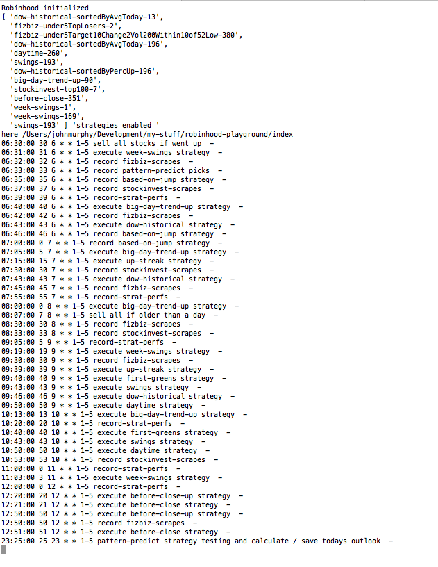
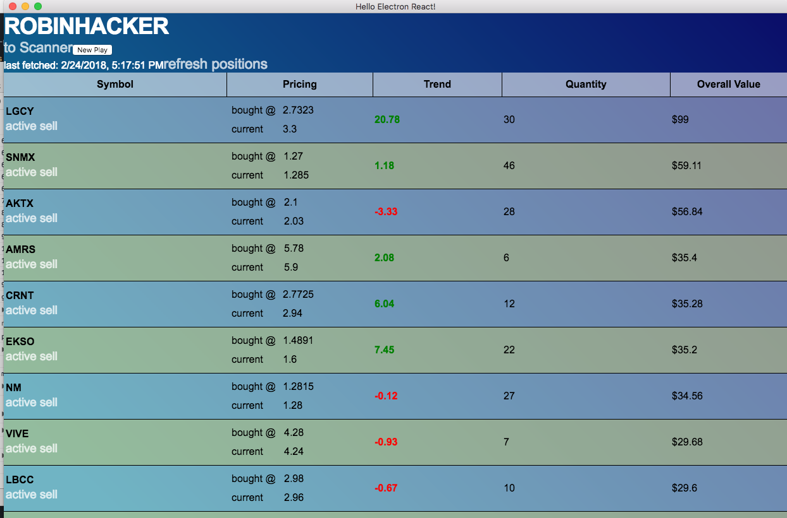
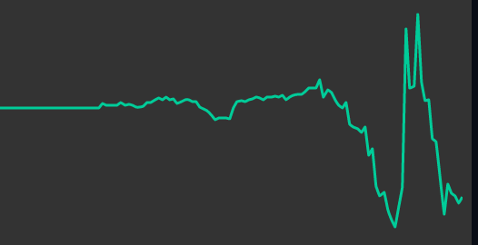

```warning: much of this talks about the stock market from somebody who still has much to learn.```

It all started with a conversation with my brothers about whether the stock market can be predicted. I said yes they said no. They pointed out that an individual stock has so many variables that determine whether or not it goes up that it is impossible to predict. This led me to take on the challenge and try to come up with a way of programmatically picking stocks that would go up. A few months later, I am inclined to say there were more correct than me. Regardless, even if I concede its more difficult than I expected to predict the overall market, still I am optimistic that I am on a track for finding a profitable strategy for picking individual stocks on a smaller scale.

Early on a decided that I was going to focus my search on penny stocks (< $1 or < $5 depending on who you ask) for a couple reasons. 1) I liked the volatility and regularly seeing those 10-20% gains in a day was attractive. 2) I agree (with some) who feel that they may be *more* predictable even though the prices may be more "manipulated" - in fact that is why I would say that is the reason they are more predictable. 3) I wanted to be able to test my strategies investing small amounts of money. 4) I welcome risk when it comes with an equal opportunity of reward; go big or go home!

## Goal

Find a consistently profitable strategy or combination of strategies that do not utilize day trades - buy in the morning / during the day and sells the following day, holding overnight perhaps two days at the most. Worth mentioning is that an individual with less than $25k invested is allowed three day trades before marked as a [pattern day trader (PDT)](https://en.wikipedia.org/wiki/Pattern_day_trader) resulting in penalties. Of course I'd like to make 3...no 5...no 10% everyday, but my first target is to beat the S&P.

## pattern-predict

My first attempt at finding a profitable strategy I called pattern-predict. The idea is that I would pull all the historical data available from Yahoo Finance for a given set of stocks. From there I would convert that data to a set of 1's and 0's that correspond to whether or not the stock went up or down in a given 24 hour period. Next I would look at the last 3 - 14 digits of this string and then look back in the historical data and see what was the percentage that the following day went up after that particular combination of 1's and 0's.

...101010111011

- 011
- 1011
- 11011
- ...and so forth

I average out the percentage it went up the following day for each of the digit permutations 3 - 14 to generate a single prediction number. That number is what I call "avg percent up". "weighted percent up" gives more weight to the avg percent up of the longer sequences of digits. I was surprised to find that there were certain stocks that went up > 75% of the time following a specific pattern 14 digit pattern, though often the number of instances it was found in the stocks' entire historical data was just a few.

What I realized was that this was not necessarily a strategy for just picking stocks, but for predicting whether anything will go up or down in any sequence of 1's and 0's. I'm sure many more-academic statisticians could give me many reasons why this strategy would not work - (perhaps saying past results do not guarantee future results- they may say like my brothers that this is equally true for predicting the stock market in general). For a brief period, I used this strategy to predict the winners of NBA basketball games by scraping the historical wins and losses of all basketball teams and then comparing pattern-predict's prediction likelihood of each team winning their next game.

At this point, I began interfacing with the Robinhood API to purchase stocks on a daily basis utilizing this pattern-predict strategy. I had my eye on Robinhood from the very beginning as it is free to trade and has a (somewhat - [thanks Sanko](https://github.com/sanko/Robinhood) public API. I added support for promises so I could use ES6/7 async await syntax. Everybody pointed out that I need to back-test this strategy so I added another step that goes back over the last year, runs this strategy for each of the days of the last year and then checks whether the strategy chose correctly. This was exciting because it took about 5-10 minutes to generate the "strategy test results" for each stock (hours total for the first run). This is the first time where I've written code that was particularly CPU intensive. Utilizing the Node.js module **cluster** to take advantage of multiple cores was rewarding as it cut down the time to process these initial strategy test results down drastically.

```
example of one stocks' strategy test results

[
  {
    "wentUpFollowingDay": true,
    "strategies": {
      "avgPerc": 41.77,
      "weightedPerc": 44.67214285714283
    },
    "rawData": {
      "Date": "2018-2-20",
      "Open": "46.84",
      "High": "48.74",
      "Low": "46.76",
      "Close": "48.07",
      "Adj Close": "48.07",
      "Volume": "4581800"
    }
  },
  {
    "wentUpFollowingDay": false,
    "strategies": {
      "avgPerc": 43.22,
      "weightedPerc": 47.17535714285714
    },
    "rawData": {
      "Date": "2018-2-16",
      "Open": "47.50",
      "High": "50.18",
      "Low": "46.52",
      "Close": "47.36",
      "Adj Close": "47.36",
      "Volume": "8372200"
    }
  },
  {
    "wentUpFollowingDay": false,
    "strategies": {
      "avgPerc": 55.07125,
      "weightedPerc": 57.47642857142859
    },
    "rawData": {
      "Date": "2018-2-15",
      "Open": "48.99",
      "High": "48.99",
      "Low": "46.19",
      "Close": "47.57",
      "Adj Close": "47.57",
      "Volume": "5113200"
    }
  },

  ...

]
```
Something encouraging about the results so far is that the "top" picks have consistently been trending higher than the "somewhat recommended" and the "not recommended" have consistently been the lowest.
## Moving forward with developing more general stock picking strategies

Soon after implementing this first strategy of pattern-predict I realized that this was not going to be easy money maker that I was hoping for. So I came up with a few more general strategies that were more based upon the trends of the day via the Robinhood API...

**big-day-trend-up** - penny stocks trending up the most since open

**daytime** - penny stocks trending up the most since open but also trending up in the last 10 days and 30 days

**before-close** - penny stocks gone down the most since open

**based-on-jump** - pennies that went up more than 3% overnight (last close to opening bell), also trending up compared to the last 7, 25 and 35 days.

At some point early on I lost a bunch of money on a stock that matched **before-close** only to realize that that stock had jumped up just a few days earlier, so I added in a getRisk() function that determines the riskiness of a stock based on if there was a big jump up recently.

I also realized that many of the purchases I was making on Robinhood were not being filled so in addition to a limitBuy function, I also created an activeBuy function that purchases it at 100% of the asking price, waits 45 seconds, and then does a check to see if it was filled. If not, it cancels the last transaction and puts in a limit buy for .003% above the asking price...and so on and so forth up to 1.02% above at which point it gives up. I do the same for activeSell that decreases the sell price until it finds a buyer. As you would expect most of the purchases and sells are being filled now, with the downside that I am at times paying a very slight premium.

## Getting creative with some outside-the-box strategies

**dow-historical** - analyze daily historical data for every penny stock to see whether or not it went up on a particular day of the week

**up-streak** - one might think that going for the stocks that have gone up 10 days in a row would be the one's you would want to put your money on, but no - my tests have shown 3, 4, or 5 days in a row have a much better chance of going up the following day

## Getting legit and hitting the books

With some hard lessons learned, clearly trading stocks was not going to be as easy as I hoped. All of these strategies that I have been working on focus on technical analysis rather than fundamental analysis and I intend on keeping it that way, but if I am going to do this right, I knew that I would have to learn from others who have been successful.

I began watching Youtube videos, reading articles and visiting forums on stock trading in general and penny stocks in particular. I learned how to read candlestick charts. The remarkable effectiveness of resistance and support. I learned about buying dips and the importance of taking volume into account when considering stocks particular pennies. A simple search for "penny stock trading strategies" and you will inevitably run across the work of Tim Sykes - penny trader and teacher extraordinaire. Although much of his work is focused on day trading and in the past he was known more for shorting than holding long, I have found much of his teachings relevant to my own goals. Worth mentioning is that I am not opposed to day trading, and I completely agree with Sykes perspective that it minimizes your risk by limiting your exposure to the markets. Whether or not you think he and his style are legit, I think he has some valuable lessons to teach. Something that I've heard him say that I find refreshing is to limit your losses instead of clinging to the hope it will turn around. "If a trade doesn't behave the way you are expecting from the get-go, get out." Since finding more resources and learning a few tricks of the trade I developed these strategies:

**swings** & **week-swings** - looks at historical data (daily / year & 10 minute intervals for the past week) and finds stocks that hit within 10%, 20% and 30% of the top and bottom a number of times and also currently coming up in the lowest bracket

**first-green** - first green day is something you will hear repeatedly from Tim Sykes. the idea is to find a stock that has been going down down down for a number of days in a row and then shows an up day. I have heard others say you should wait 3 days before investing; currently this strategy purchases in the morning following a first-green day.

## Scraping strategies

I also discovered [Fizbiz](http://fizbiz.com/) which is a popular website for screening stocks in similar ways to how I am doing manually using the Robinhood API. The number of options is astounding and the fact that it happens instantly is nice too.

```
const config = {
    RUN: [2, 12, 75, 120, 180, 380],
    QUERIES: {
        under5Target10Change2Vol200Within10of52Low: 'https://finviz.com/screener.ashx?v=111&f=cap_smallover,sh_curvol_o200,sh_price_u5,ta_change_u2,ta_changeopen_u,ta_highlow50d_a0to10h,targetprice_a10&ft=4&o=-change',
        under5Target10Change2Vol200: 'https://finviz.com/screener.ashx?v=111&f=cap_smallover,sh_curvol_o200,sh_price_u5,ta_change_u2,ta_changeopen_u,targetprice_a10&ft=4&o=-change',
        under5TopLosers: 'https://finviz.com/screener.ashx?v=111&s=ta_toplosers&f=sh_price_u5',
        nanoEarlyRunners: 'https://finviz.com/screener.ashx?v=111&f=cap_nano,sh_avgvol_o200,sh_price_u10,sh_relvol_o2,sh_short_u30,ta_rsi_os40&ft=4&o=-change'
    },
};
```

[StockInvest.us](http://stockinvest.us/) is another cool website that makes recommendations using much more complex algorithms. Don't tell them, but I am scraping their "top 100" list and filtering for the penny stocks. Surprisingly promising so far.

## Gametime! Bringing it all together

At this point- for each strategy I supply an array of integers that correspond to a number of minutes after 6:30am (opening bell PST) to run this strategy. Most run 3 or 4 times a day.



I only recently started saving these picks for every strategy even if the strategy is not "enabled". Currently I supply an array of strings "[strategy-name]-[min after 6:30]" that determines whether to actually enable / purchase that strategy's "picks". At any point I can get the "strategy performance" for the day that runs through all the saved strategy's "picks" for each run that it did today and calculate how each of the "picks" trended since the time it was picked. This strategy performance is saved as JSON for the previous day at various times so I can determine what is the best time to buy and sell for each of the strategies and how it has done on average over the last x days.

## Lessons learned

* The overall stock market affects individual stocks more than I expected. I was surprised to find how many stocks' daily trend-lines end up shaped remarkably similar to the major indexes.

* The recent market volatility has made it difficult to determine whether it is just a bad day or whether the strategy needs tweaking. Sometimes the best trade is no trade...but I am not doing that.

* You have to be okay with losing money some days.

* You can make money off a "bad" stock. You can lose money off a "good" stock. It's all about timing.

## Moving forward

There are many improvements that I will continue to be working on from the strategic side of things as well as from a more programmatic side of things. I am learning things about the stock market everyday and the code itself has gotten a bit unwieldy in places. Another aspects of the program that I would like to integrate better is this Electron front-end that has been swimming on its own. Also I have been thinking about making a public API - or email list - that returns my current top recommendations.



Other aspects I would like to strategize... stocks releasing earning reports. twitter sentiment. stocks that go up > 90% of the time after the S&P goes down / up. stocks that have strange correlations such as when the SF Giants win. taking into account RSI, SMA, EMA...

## A note before I show you what you'll all been waiting for...

Even though I have been dipping my toe in the water for a couple months now, I still feel like I am just scraping the surface. Up until recently Robinhood was the only stock broker that I was using so the trend shown below is more representative of the hand-picked stocks I was going for more-so than the Node script I have been working on. Clearly it has been a rocky road and I have learned the hard way of getting in and out of hyped up stocks. I have since moved my hand-picked long-term and short-terms buys over to other brokers (+$200 in the last two days) so this graph is not entirely accurate to how this program has been running. I look forward to seeing where things go from here now that I have all my strategies being documented and I can calculate the effectiveness of these strategies.



Still... I have had a lot of fun working on this project, I am learning new lessons about the stock market everyday...and most importantly...BPMX, CEI and AKER for the win!

Github: https://github.com/chiefsmurph/robinhood-playground
